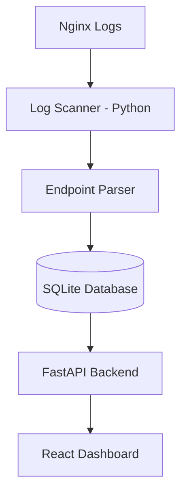

# API Radar MVP 🚀

API Radar je prvá MVP verzia nástroja na **objavovanie API endpointov zo serverových logov**. 
Cieľom je automaticky získať prehľad o tom, **aké endpointy sa na serveri reálne používajú**, vrátane potenciálne nezdokumentovaných alebo zabudnutých API ciest.

## Why this exists

In many infrastructures developers do not have a clear overview of which API endpoints are actually active. 

Over time systems accumulate:
- legacy routes
- debug endpoints
- test APIs
- undocumented internal paths

This creates **shadow APIs** which can become a security and maintenance risk. API Radar aims to automatically discover these endpoints by analyzing real server traffic.

## Aktuálne MVP obsahuje

### 1. Log scanner
Python skript číta Nginx access logy a priebežne z nich extrahuje API requesty.

### 2. Endpoint parser
Zo záznamov sa spracujú HTTP metóda, path a počet výskytov.

### 3. Ukladanie dát
Výsledky sa ukladajú do SQLite databázy ako základná endpoint inventory vrstva.

### 4. Backend API & Dashboard
FastAPI endpoint sprístupňuje dáta pre React dashboard, ktorý zobrazuje aktivitu v reálnom čase.

## Architecture



## Quick Start

### 1. Clone the repository
```bash
git clone https://github.com/youh4ck3dme/api-radar.git
cd api-radar
```

### 2. Start with Docker
```bash
docker-compose -f docker/docker-compose.yml up --build
```

### 3. Open dashboard
Open your browser at `http://localhost:6666` (Vue.js) or check API at `http://localhost:8000/endpoints`.

## Overené v MVP
Testovací scenár potvrdil, že systém vie načítať logy, rozpoznať endpointy a spočítať výskyty.
```bash
GET /api/users -> 2
POST /api/login -> 1
GET /api/dashboard/stats -> 1
```

## Čo je ďalší krok
Ďalšia fáza MVP bude zameraná na:
- porovnanie observed vs known endpoints
- **detekciu shadow API** (Shadow Detection Engine)
- základné risk scoring pravidlá
- filtrovanie interných / verejných endpointov
